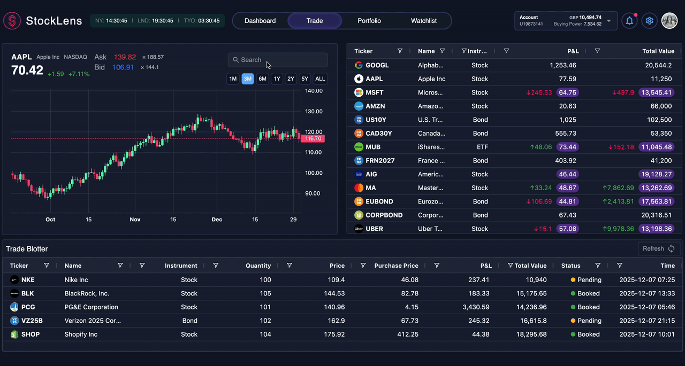

# Real-Time Streaming Micro-Frontend Trading Platform

A financial trading platform built with micro-frontend architecture with real-time data streaming, modular component design, and integration of multiple frontend applications.



## 🏗️ Architecture Overview

This project implements a **Micro-Frontend (MFE) architecture** using **Module Federation** to create a system that consists of independent frontend applications providing a unified trading experience.

### Core Components

- **🖥️ Shell App** (Port 8000): Main container application with navigation
- **📊 Trade MFE** (Port 5002): Trading interface with charts and instrument display
- **📋 Blotter MFE** (Port 5003): Trade blotter and position display
- **📈 Portfolio MFE** (Port 5001): Portfolio management placegolder (in development)
- **🔌 Mock WebSocket Server** (Port 4000): Backend simulation with real-time data

## ✨ Key Features

### Real-Time Data Streaming

- **WebSocket Integration**: Live market data updates using Protocol Buffers
- **Automatic Updates**: Continuous price and trade data refreshes
- **Efficient Serialization**: Binary data transmission for optimal performance

### Micro-Frontend Architecture

- **Module Federation**: Dynamic loading of remote applications
- **Shared Dependencies**: Optimized bundle sizes through dependency sharing
- **State Persistence**: KeepAlive routing maintains component state

### Trading Interface

- **Interactive Charts**: Real-time candlestick charts with TradingView integration
- **Market Data Grid**: Live instrument data with sorting and filtering
- **Trade Blotter**: Real-time position and execution monitoring

## 🚀 Quick Start

### Installation

1. **Clone the repository**

2. **Install all dependencies:**

   ```bash
   npm install
   ```

3. **Start the complete system:**
   ```bash
   npm run dev:all
   ```

This single command will:

- Start the mock WebSocket server (port 4000)
- Build all micro-frontend applications
- Launch the shell application (port 8000)

4. **Open your browser:**
   ```
   http://localhost:8000
   ```

## 📁 Project Structure

```
real-time-streaming-mfe/
├── shell/                   # Main container application
├── trade-mfe/               # Trading interface MFE
├── blotter-mfe/             # Trade blotter MFE
├── portfolio-mfe/           # Portfolio management MFE
├── mock-ws-server/          # Backend simulation
└── package.json             # Workspace configuration
```

## 🔧 Technology Stack

### Frontend Framework

- **React 19**
- **TypeScript**
- **Vite** - Fast build tool and development server
- **Redux** - State management
- **React Query** - State management and caching
- **RxJS** - Reactive programming for real-time data
- **AG Grid** - High-performance data grids
- **Lightweight Charts** - Financial charting library
- **Material-UI** - Component library and theming
- **Styled Components** - CSS-in-JS styling
- **Framer Motion** - Animations and transitions

### Server, Data & Communication

- **WebSocket** - Real-time bidirectional communication
- **Protocol Buffers** - Binary serialization
- **REST APIs**
- **Express.js** - Backend API server

### Development Tools

- **ESLint** - Code linting and formatting
- **Module Federation** - Micro-frontend architecture

## 🌐 Ports and Endpoints

| Service       | Port | Purpose                    |
| ------------- | ---- | -------------------------- |
| Shell App     | 8000 | Main application container |
| Trade MFE     | 5002 | Trading interface          |
| Blotter MFE   | 5003 | Trade blotter              |
| Portfolio MFE | 5001 | Portfolio management       |
| Mock Server   | 4000 | WebSocket & REST APIs      |

### API Endpoints

**WebSocket** (Port 4000):

- `ws://localhost:4000` - Real-time trade data streaming

**REST APIs** (Port 4000):

- `GET /search?searchString=<ticker>` - Instrument search
- `GET /candles?searchString=<ticker>` - Historical price data
- `GET /blotter` - Trade blotter data

## 📊 Performance

- **Code Splitting**: Automatic code splitting with dynamic imports
- **Bundle Optimization**: Shared dependencies reduce bundle sizes
- **Lazy Loading**: MFEs loaded on-demand
- **Caching**: React Query caching for API responses
- **WebSocket Efficiency**: Binary serialization minimizes bandwidth
